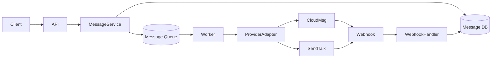
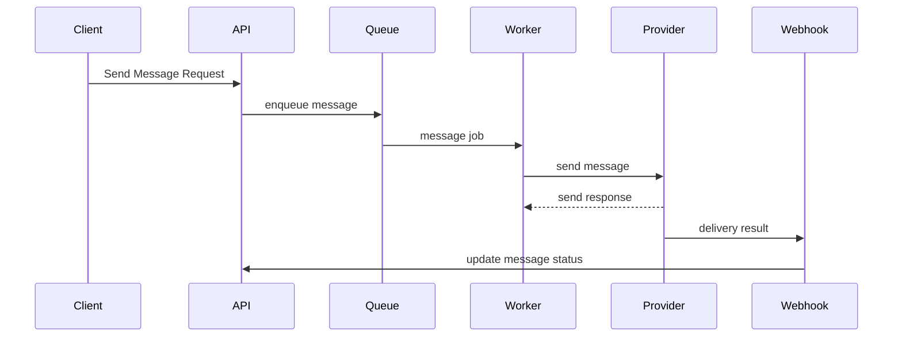
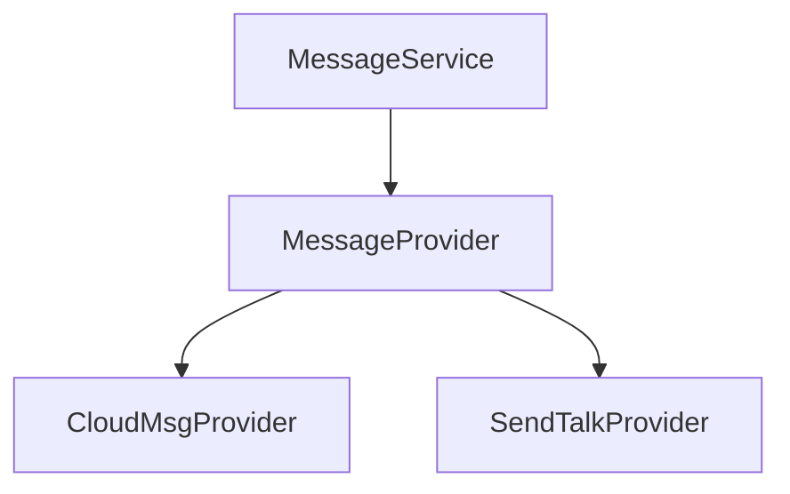
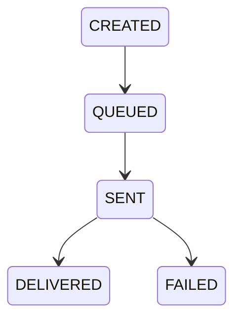
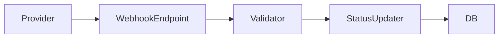

# Messaging Platform Server Design

## Part A. 서버 설계

본 문서는 기존 메시지 시스템을 **확장성과 Provider 독립성**을 고려한
구조로 재설계하기 위한 서버 설계 문서입니다.

설계 목표:

- Provider 의존성 제거
- Queue 기반 비동기 메시지 처리
- 채널 확장성 확보 (SMS / MMS / AlimTalk 등)
- Provider 교체 또는 추가 용이성 확보
- Webhook 기반 상태 업데이트

---

# 1. 전체 시스템 아키텍처



설명

| 구성 요소 | 설명 |
|-----------|------|
| API | 메시지 생성 요청 수신 |
| MessageService | 메시지 생성 및 Queue 등록 |
| Queue | 비동기 메시지 처리 |
| Worker | 실제 Provider 호출 |
| ProviderAdapter | Provider API 추상화 |
| WebhookHandler | 메시지 상태 업데이트 |

---

# 2. 메시지 처리 Sequence Diagram



---

# 3. 주요 설계 포인트

## 3.1 Provider 추상화 (Adapter Pattern)

Provider API 구조가 서로 다르기 때문에 Adapter Layer를 도입합니다.



### Provider Interface

```text
interface MessageProvider {

 sendSMS(message)

 sendMMS(message)

 sendAlimTalk(message)

}
```

Provider 구현체

- CloudMsgProvider
- SendTalkProvider

각 Provider는 다음 책임을 가집니다.

- 인증 처리
- Payload 변환
- 응답 변환
- 오류 처리

---

# 4. 메시지 데이터 모델

## Message

| 필드      | 설명                 |
| --------- | -------------------- |
| id        | 메시지 ID            |
| userId    | 사용자               |
| channel   | SMS / MMS / ALIMTALK |
| provider  | 선택된 Provider      |
| content   | 메시지 내용          |
| status    | 메시지 상태          |
| createdAt | 생성 시간            |

---

## UserGroup

| 필드 | 설명      |
| ---- | --------- |
| id   | 그룹 ID   |
| name | 그룹 이름 |

---

# 5. Message State Machine



| 상태      | 설명          |
| --------- | ------------- |
| CREATED   | 메시지 생성   |
| QUEUED    | Queue 등록    |
| SENT      | Provider 전달 |
| DELIVERED | 전달 완료     |
| FAILED    | 전달 실패     |

---

# 6. 기술적 결정 사항 (Technical Decisions)

## 6.1 Provider 연동 방식

### 문제

CloudMsg와 SendTalk는 API 구조와 인증 방식이 서로 다르다.

- CloudMsg: HMAC Signature 기반 인증
- SendTalk: Bearer Token 기반 인증

또한 향후 새로운 메시지 Provider가 추가될 가능성이 있다.

따라서 서비스 로직과 Provider API를 분리하는 구조가 필요하다.

### 대안 비교

#### 대안 1 — Service Layer에서 Provider 직접 호출

MessageService → CloudMsg API  
MessageService → SendTalk API

**장점**

- 구현이 단순함
- 별도 Layer가 필요 없음

**단점**

- Provider 추가 시 Service 코드 수정 필요
- 테스트 어려움
- Provider 교체 비용 증가

#### 대안 2 — Adapter Pattern 기반 Provider Layer 도입

MessageService → MessageProvider Interface → Provider 구현체

예시

- CloudMsgProvider
- SendTalkProvider

**장점**

- Provider 변경 시 영향 최소화
- 새로운 Provider 추가 용이
- 테스트 및 Mock 처리 가능

**단점**

- 초기 설계 복잡도 증가

### 선택

**Adapter Pattern 기반 Provider 추상화 구조**

### 선택 근거

- Provider API 구조가 서로 다름
- 향후 Provider 확장 가능성 존재
- 서비스 로직과 외부 API 의존성 분리 필요

---

## 6.2 메시지 처리 방식

### 문제

메시지 발송은 외부 Provider API 호출이 포함된다.

특히 다음 상황이 발생할 수 있다.

- 대량 메시지 발송
- Provider Rate Limit
- Provider 장애

동기 처리 방식으로 구현할 경우 API 응답 지연 및 시스템 장애 가능성이 있다.

### 대안 비교

#### 대안 1 — 동기 처리 방식

Client → API → Provider API → Response

**장점**

- 구조 단순
- 구현 빠름

**단점**

- API 응답 시간 증가
- 대량 메시지 처리 어려움
- Rate Limit 발생 시 장애 가능

#### 대안 2 — Queue 기반 비동기 처리

Client → API → Queue → Worker → Provider API

**장점**

- API 응답 속도 개선
- Worker 확장을 통한 수평 확장 가능
- Rate Limit 대응 가능

**단점**

- Queue 인프라 필요
- 시스템 구성 복잡도 증가

### 선택

**Queue 기반 비동기 메시지 처리 구조**

### 선택 근거

- 메시지 발송은 비동기 작업에 적합
- 대량 메시지 처리 가능
- Worker 확장을 통한 트래픽 대응 가능

---

## 6.3 Provider 선택 시점

### 문제

고객사(Organization)별로 서로 다른 Provider를 사용해야 한다.

예시

- A 조직 → CloudMsg
- B 조직 → SendTalk

따라서 메시지 발송 시 Provider를 선택해야 한다.

### 대안 비교

#### 대안 1 — Worker 단계에서 Provider 결정

Message → Queue → Worker → Provider 선택

**장점**

- Worker에서 동적 선택 가능

**단점**

- 메시지 데이터에 Provider 정보 없음
- 장애 분석 및 통계 어려움

#### 대안 2 — 메시지 생성 시점에 Provider 결정

API → Organization 조회 → Provider 선택 → Message 저장

**장점**

- 메시지 데이터에 Provider 정보 기록
- 통계 분석 가능
- 장애 분석 용이

**단점**

- Provider 변경 시 정책 관리 필요

### 선택

**메시지 생성 시점에 Provider 선택**

### 선택 근거

- 메시지 추적성 확보
- Provider별 통계 분석 가능
- 장애 발생 시 원인 분석 용이

---

## 6.4 메시지 상태 처리 방식

### 문제

메시지 전달 상태를 정확하게 관리해야 한다.

예시 상태

- QUEUED
- SENT
- DELIVERED
- FAILED

Provider에서 전달 상태를 확인해야 한다.

### 대안 비교

#### 대안 1 — Polling 방식

Worker → Provider Status API 주기적 호출

**장점**

- 구현 단순

**단점**

- API 호출 증가
- 비용 증가
- 상태 반영 지연

#### 대안 2 — Webhook 기반 상태 처리

Provider → Webhook → 상태 업데이트

**장점**

- 실시간 상태 반영
- API 호출 감소

**단점**

- 보안 검증 필요

### 선택

**Webhook 기반 메시지 상태 처리**

### 선택 근거

- CloudMsg / SendTalk 모두 Webhook 제공
- 실시간 상태 반영 가능
- 서버 부하 감소

---

## 6.5 전화번호 표준화 전략

### 문제

Provider마다 전화번호 형식이 다르다.

예시

| Provider | 형식          |
| -------- | ------------- |
| CloudMsg | +821012345678 |
| SendTalk | 01012345678   |

### 대안 비교

#### 대안 1 — Provider 호출 시 변환

각 Provider Adapter에서 변환

**장점**

- Adapter에서 처리 가능

**단점**

- 시스템 내부 데이터 형식 불일치

#### 대안 2 — 내부 전화번호 표준화

시스템 내부 표준

+821012345678

Provider 호출 시 변환

### 선택

**내부 표준 전화번호 포맷 유지**

### 선택 근거

- 데이터 일관성 확보
- Provider 추가 시 영향 최소화

---

# 7. Batch 처리 전략

CloudMsg는 Batch API를 지원합니다.

    POST /messages/batch
    max 1000 messages

Worker 처리 전략

```text
if provider == CLOUDMSG
  batch send

if provider == SENDTALK
  single send
```

---

# 8. Webhook 처리

Provider는 메시지 상태를 Webhook으로 전달합니다.



Webhook 검증

- Signature 검증
- Timestamp 검증

---

# 9. Phone Number Normalization

Provider마다 전화번호 형식이 다릅니다.

내부 표준

    +821012345678

Provider 변환

| Provider | 형식 |
|----------|------|
| CloudMsg | +821012345678 |
| SendTalk | 01012345678 |

# 10. 작업 단계

| 단계 | 목표 | 산출물 |
|------|------|--------|
| 1 | 메시지 모델 설계 | DB Schema |
| 2 | Message API 구현 | REST API |
| 3 | Queue 도입 | Worker |
| 4 | Provider Adapter 구현 | Provider Layer |
| 5 | Webhook 구현 | 상태 업데이트 |

---

# 11. 리스크 및 대응

| 위험 요소 | 영향 | 대응 |
|-----------|------|------|
| Provider API 장애 | 메시지 발송 실패 | Provider fallback |
| Rate Limit | 메시지 지연 | Queue buffering |
| Webhook 누락 | 상태 불일치 | Retry Job |

---

# 12. 확장성 설계

이 구조는 다음 확장이 가능합니다.

새 Provider 추가

    class TwilioProvider implements MessageProvider

새 채널 추가

    sendWhatsApp()
    sendPush()

---

# 13. AI 활용 프롬프트

본 설계 문서는 AI 도구를 활용하여 구조 설계와 문서화를 보조받아
작성되었습니다.

사용한 프롬프트 예시

### 아키텍처 설계

    Design a scalable messaging platform architecture supporting multiple providers such as SMS and AlimTalk.
    Include queue based asynchronous processing and provider abstraction.

### API 설계

    Design REST APIs for a messaging platform that supports message creation, queue processing, and webhook status updates.

### README 구조화

    Write a technical README for a messaging system architecture including diagrams, provider abstraction, queue based processing and risk analysis.

AI는 설계 보조 및 문서 정리에 활용되었으며 실제 구조와 의사결정은
작성자가 검토 후 반영하였습니다.

---

# 결론

본 설계는

- Provider 의존성 제거
- Queue 기반 확장성
- Webhook 기반 상태 관리

를 중심으로 메시지 시스템의 **확장성과 안정성**을 확보하는 것을 목표로
합니다.
